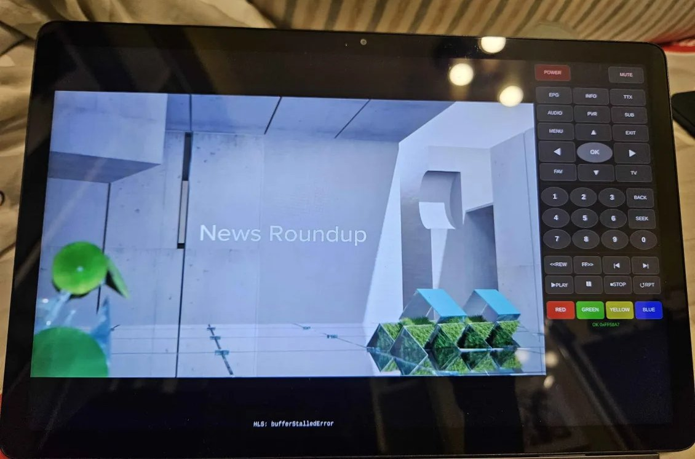
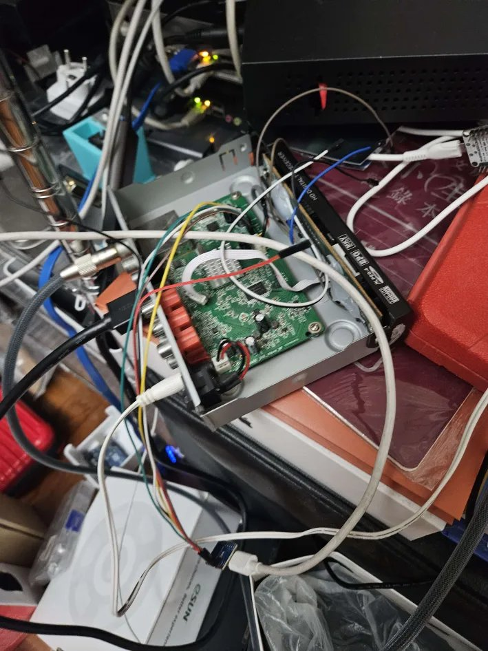

# DMR-39 Remote Bridge

**Reverse-engineering a set-top box with no API, no network, and no documentation — using an AI pair programmer, an HDMI capture card, and a lot of solder.**

> Built entirely through agentic coding with [Claude Code](https://claude.ai/code). Every protocol detail was discovered empirically — there is no documentation for this device. The conversation ran 20,000+ lines (63MB) in a single session.


*Live TV stream with full 41-button remote control — all served from a single URL.*

---

## What This Is

A complete system for remotely viewing and controlling a SUPER DMR-39 digital TV set-top box over the network.


The DMR-39 is a 2016-era Hong Kong DVB-T2 receiver (board code `MSD7816_88969T_608_148mm_NP`, firmware `V1.01 2016.04.02`). It has no Ethernet, no Bluetooth, and no documented protocol. The USB port is for DVR recording and firmware updates only — neither of which is useful here. The only viable interfaces are a 38kHz IR receiver and a 5-pin I2C front panel connector. As of March 2026, it turns 10 years old next month.

The final system:
- **ESP32-C3** taps the demodulated IR trace on the PCB — no IR LED needed
- **Web remote control** with all 41 buttons mapped via NEC protocol
- **HLS live stream** of the TV output with synced audio via VAAPI hardware encoding
- **Nonce authentication** on the relay server to prevent unauthorized IR commands
- **Single-port web UI** combining the TV stream and remote control, tunnel-ready
- **OTA firmware updates** with password authentication (device is in a sealed enclosure)

```
                   ┌──────────────────────────────┐
Physical Remote ──>│ IR Receiver (demodulated) ──> │──> STB
                   │   GPIO3 (sniff)    GPIO0 (TX) │
                   │        ESP32-C3               │
                   │   WiFi Web Server :80         │
                   └──────────┬───────────────────┘
                              │ /ir?code=A25D
                   ┌──────────┴───────────────────┐
                   │  Relay Server :8889           │
                   │  HLS Video + AAC Audio        │
                   │  + IR Relay + Nonce Auth       │
                   │  (VAAPI H.264 encode)          │
                   └──────────┬───────────────────┘
                              │ Cloudflare Tunnel
                           Browser
```

## The Journey

### Act 0. Feasibility Research (pre-code)

Before any code was written, the first step was figuring out whether this device could be controlled at all. The STB was opened, the PCB photographed, and the board markings (`MSD7816_88969T_608_148mm_NP`) fed to Claude for research.

Claude identified the main SoC as an **MStar MSD7816** (a budget DVB-T2 decoder common in Chinese/Hong Kong STBs), and the front panel driver as a **TM1650-compatible chip** (the board used an **HW650EP** clone). The TM1650 datasheet revealed a simple I2C protocol: the SoC writes display segments and reads key-scan responses. In theory, an ESP8266 could impersonate the front panel — intercepting display writes to read the channel number and injecting key-scan responses to simulate button presses.

The feasibility verdict: **possible, but no one had documented doing it.** No open-source TM1650 slave implementations existed. The I2C timing requirements were tight. The only way to know if it would work was to try.

### Act 1. I2C Slave Emulation — The 27-Strategy Gauntlet

<details>
<summary>The hardware setup the AI agent got to work with (click to expand)</summary>



*This is not winning any beauty contests. The DMR-39 STB with its case removed, ESP32-C3 dangling off jumper wires soldered to PCB traces, USB HDMI capture card, and various other homelab equipment sharing the shelf. This is what the AI agent was staring at (via the HDMI capture card) during its overnight debugging sessions.*

</details>

The first approach was to remove the front panel and impersonate its HW650EP display/key-scanner chip (TM1650 clone) over I2C. An ESP8266 would decode display writes (to read the channel number) and inject key-scan responses (to simulate button presses).

What followed was one of the most grueling debugging marathons in embedded development. Across multiple all-night sessions — with Claude Code posting progress updates to an e-paper board while the user slept — **27 distinct GPIO injection strategies** were attempted on the ESP8266:

- Phase-synced pulse injection timed to the HW650EP's 22ms scan cycle
- ISR-based I2C slave emulation iterated through **11 versions** (V1-V11)
- Direct register-level GPIO manipulation at 160MHz
- Dual ISR (one on SDA for START/STOP, one on CLK for bit sampling)
- Polling at 1.2 million iterations/second with triple-sample noise filters

The STB's I2C bus ran at ~250kHz — far faster than the expected 100kHz — with severe electrical ringing on the jumper wires. The ESP8266's interrupt latency (3-5 microseconds) meant START conditions were consistently missed. Address bytes read as 0x9F and 0xFF — analysis revealed this was consistent with sampling at the wrong clock phase, not a wiring error.

**V4 was the high-water mark**: successfully decoded 39 real I2C transactions and read correct display addresses (0x6E). But false START/STOP detections corrupted subsequent reads. Migrating to the ESP32-C3 for hardware I2C support uncovered a critical insight: **ACKing every I2C address put the STB into degraded mode** (displaying "----"). The STB used NACK responses to fingerprint its front panel. Switching to selective ACK — only responding on the genuine TM1650 address range — immediately caused real channel numbers to appear.

### Act 2. The 256-Value Brute Force Sweep

With key injection proven, the question was: which of 256 possible byte values corresponded to actual remote buttons? Neither the TM1650 datasheet nor the STB firmware offered a lookup table.

The solution was fully automated brute force. The ESP32-C3 cycled through all 256 values, injecting each into the key scan response while monitoring for reactions via **two feedback channels**:
- I2C display writes (detectable when the STB updated its front panel)
- HDMI frame size changes (a USB capture card's JPEG file size would jump when an OSD appeared)

A **dumb mechanical timer** on the STB's power supply provided automated power cycling — one minute on, one minute off — giving ~50 seconds of usable sweep time per cycle. The firmware tracked position across reboots, resuming automatically. RapidOCR parsed HDMI screenshots to detect on-screen menu text.

After six full power cycles, most values produced nothing. Then at **value 0xE0**, the HDMI frame size jumped 33% — a volume OSD appeared on screen. It was the first and ultimately only key code discovered through I2C injection. After 256 values yielded exactly one working button, the decision to pivot was obvious.

### Act 3. "ngl I think I2C is too hard"

The user typed the message that changed everything. They had traced two demodulated IR lines on the STB's PCB:

```
GPIO3 ← Front panel IR receiver (demodulated RX, active LOW)
GPIO0 → STB IR input trace (demodulated TX)
GPIO1 ← STB VCC rail (power state detection)
```

No 38kHz carrier to worry about — just clean digital pulses on a wire. What had taken weeks of I2C agony would be accomplished in a single evening.

### Act 4. Three Capture Approaches

**Attempt 1 — Hand-rolled ISR**: Attached interrupts on GPIO3, recorded `micros()` timestamps, computed intervals. NEC frames kept fragmenting — WiFi stack interrupts preempted the ISR, producing 20 bits instead of 32, leaders followed by garbage.

**Attempt 2 — Improved ISR with gap detection**: Raised the inter-frame gap threshold (15ms → 50ms → 100ms), removed debounce, added double-buffering. Still fragmented. The user cut through the complexity: *"How do people decode NEC signals? Maybe we can use existing battle-tested code rather than handrolling our own?"*

**Attempt 3 — IRremoteESP8266 + RMT hardware**: The ESP32-C3's RMT peripheral captures edges in a hardware FIFO with microsecond precision, immune to software interrupt jitter. Clean NEC decodes on every press, instantly.

But using the library created a new problem: the RMT peripheral claimed GPIO3, killing the ISR-based real-time passthrough. The solution was **auto-forward mode**: capture a full NEC frame via the library (~15ms after signal ends), then replay the raw timing on GPIO0 using direct GPIO register writes. The 20-30ms delay is imperceptible to the user, and the original remote works exactly as before.

### Act 5. Mapping All 41 Buttons

With auto-forward running, the original remote still worked normally while every press was logged. An interactive CLI (`ircli.py`) over USB serial provided the workflow, with HDMI screenshot integration to visually confirm each button's effect.

The user pressed through every button systematically in groups:
- Navigation: MENU, EXIT, UP/DOWN/LEFT/RIGHT/OK
- Function: EPG, INFO, TTX, AUDIO, PVR, SUB
- Number pad: 0-9
- Transport: REW, FF, PREV, NEXT, PLAY, PAUSE, STOP, REPLAY
- Color: RED, GREEN, YELLOW, BLUE
- System: POWER, MUTE, FAV, TV, BACK, SEEK

A final "pat-down" pass (top-to-bottom, left-to-right) confirmed no buttons were missed and discovered aliases: LEFT/RIGHT double as VOL-/VOL+, UP/DOWN as CH+/CH-.

Result: [`ir_codes.json`](ir_codes.json) — complete NEC code mapping for all 41 buttons.

### Act 6. The MSB/LSB Bug

The web remote looked perfect. The ESP32-C3 received `/ir?code=A25D`, constructed the NEC frame, bit-banged it with microsecond timing — and the STB completely ignored it. Waveforms looked correct: right leader, right bit count, right pulse widths.

The root cause: **the IRremoteESP8266 library stores NEC values MSB-first**, but the hand-rolled `sendNEC()` iterated bits LSB-first. This produced a valid NEC frame with a completely different code — one the STB had never seen. The fix was a single line change:

```cpp
// Before (broken): for (int i = 0; i < 32; i++)
// After (working):
for (int i = 31; i >= 0; i--) {
```

The user was in the shower when this was debugged and fixed. They returned to find the entire chain working end-to-end, verified via HDMI capture: MENU opened settings, EXIT closed it, CH+ changed to TVB Plus.

### Act 7. Streaming Infrastructure

The project outgrew "just a remote" when the user wanted to view and control the TV from anywhere.

**Evolution of the streaming server:**
1. **MJPEG snapshots** — simple `/snapshot` from USB HDMI capture
2. **MJPEG + separate MP3** — video and audio couldn't sync (painful desync)
3. **HLS with VAAPI** — single ffmpeg process, hardware H.264 encode on Intel HD 4000 (i965 driver), muxed AAC audio, 1-second segments

CPU benchmarking on i7-3632QM (Ivy Bridge):
| Component | CPU % | Notes |
|-----------|-------|-------|
| MJPEG software decode | 46% | Ivy Bridge has no MJPEG HW decode (added in Haswell) |
| VAAPI H.264 encode | 5% | On Intel HD 4000 GPU |
| AAC software encode | 20% | No HW audio encoder exists on any consumer platform |
| **Total** | **65%** | One core of an 8-thread CPU |

Hardware upgrade analysis showed an **Intel N5095** (Jasper Lake) would drop this to ~11% via VAAPI MJPEG hardware decode, while an **NVIDIA Quadro K620** (Maxwell GM107) with NVDEC MJPEG + NVENC H.264 would offload all video to GPU entirely.

### Act 8. Security (and Over-Engineering)

The first security implementation was a two-layer HMAC-SHA256 scheme: per-session nonces from the relay server to the browser, plus monotonic sequence counters and truncated HMAC signatures from the relay to the ESP32-C3. The ESP32 validated via mbedtls and rejected replayed sequence numbers.

The user took one look and said: *"This seems very flakey. Can we not have this scheme altogether?"*

They were right. The HMAC scheme was fragile across reboots, added complexity for a LAN-only device, and solved a threat that didn't exist (who's sending rogue IR commands on a home network?). The entire HMAC layer was stripped from the ESP32 firmware. What remained was simpler and sufficient:

- **Browser → Relay Server**: Per-session nonce token (`secrets.token_urlsafe`, 1-hour TTL), issued on page load, required on every `/ir` request. Prevents drive-by requests from other tabs/sites.
- **Relay Server → ESP32-C3**: Direct HTTP, no auth. The ESP32 accepts `/ir?code=XXXX` from anyone on the LAN. Acceptable risk for a home network device.

**The lesson: security should match the threat model, not the engineer's enthusiasm.** HMAC on a LAN IR blaster was a solution looking for a problem.

### Act 9. Consolidation and Code Review

Three separate project directories had accumulated during the iterative development:
- `dmr-39/` — reference images only
- `dmr39-bridge/` — the ESP8266 I2C code (abandoned) and the Python streaming server
- `dmr39-c3/` — the ESP32-C3 IR firmware (active)

These were consolidated into a single `dmr39/` repository. The ESP8266 code was preserved in `archive/esp8266-bridge/` as historical documentation. A git repo was initialized.

A code review — conducted by the AI against its own code — found multiple issues:

| Severity | Issue | Fix |
|----------|-------|-----|
| HIGH | Path traversal in HLS file serving (`%2F`/`%2e%2e` bypass) | `os.path.realpath()` + prefix check |
| HIGH | OTA password hardcoded in `platformio.ini` | Externalized to `$DMR39_OTA_PASS` env var |
| HIGH | No input validation on IR code parameter | `isHex()` on ESP32, `re.fullmatch` on relay |
| MEDIUM | Null pointer dereference on IR decode alloc failure | Added nullptr guard |
| MEDIUM | No WiFi auto-reconnect on ESP32 | Added `WiFi.reconnect()` in 30s alive loop |
| MEDIUM | urllib response object leak | Wrapped in `with` context manager |
| MEDIUM | Error messages leaking internal ESP32 IP | Generic `502 relay error` |
| LOW | HLS cleanup race condition (delete during segment write) | `try/except FileNotFoundError` |

The OTA password was also scrubbed from git history (it had been in `platformio.ini` in an earlier draft). WiFi credentials were confirmed never committed — only the `.example` template was tracked.

### Act 10. Deploying to the Homelab (and Getting Locked Out)

The project needed documentation on the homelab docs server, hosted by lighttpd on an ASUS RT-AX82U router at `192.168.50.1:8080`. Deploying required SSH to the router on port 3131.

What followed was a small comedy of errors:

1. The AI tried `sshpass -p '***' ssh evnchn@192.168.50.1 -p 3131` — **Permission denied**
2. Why? The SSH client found local keys in `~/.ssh/` and tried them first, ignoring the password
3. Each failed key attempt counted as a brute-force attempt on the router
4. After enough failures, the router **blocked the IP entirely**
5. Port 3131 went from "connection refused" to "connection timed out" — full lockout

The fix required two things: `-o PubkeyAuthentication=no` to force password-only auth, and jumping through `.180` (the N5095 hub) since `.156` was now blocked. The router also had no `sftp-server`, so file transfers required `cat file | ssh cat > remotefile` instead of `scp`.

The AI locked itself out of its own infrastructure by being too eager to help. The user had to explain the lockout mechanism and suggest the jump host. Once the pattern was established, docs were deployed successfully.

### Act 11. Mobile UI and the Remote That Didn't Feel Like a Remote

The user tested the web remote on their phone and reported two issues:
1. In portrait mode, the remote was **too wide** — it didn't feel like holding a remote control
2. Safari's dynamic address bar caused the page to overflow (the classic `100vh` problem)

The standalone ESP32 remote was narrowed from `max-width:340px` to `240px` with proportionally smaller buttons and gaps. The HLS page's mobile layout was constrained to `max-width:280px` centered, instead of spanning the full phone width. Both pages got `100dvh` with `100vh` fallback for Safari's dynamic viewport.

The ESP32-C3 was updated over-the-air from the dev machine — the first real use of the OTA system that had been set up earlier. The relay server on `.180` was updated via SSH and restarted without touching any of the 20 other Docker containers on the machine.

### Act 12. Product Photos (or: Background Removal Without Photoshop)

The README needed product photos, but the only images were phone snapshots of the STB on a cluttered shelf with dark wood flooring and a beige wall. No Photoshop, no `numpy` (system Python refused `pip install` without `--break-system-packages`), and Claude Code is a code tool — not an image editor.

What followed was a surprisingly involved background removal pipeline built entirely from Pillow and API calls:

1. **Flood fill from edges** (Pillow only): walk inward from the image border, whitening any pixel above a brightness threshold. This cleaned ~80% of the background but couldn't reach dark floor patches that were surrounded by the STB's dark body.

2. **Manual polygon painting** (Pillow `ImageDraw`): estimate the STB's left edge as a line, paint everything left of it white. This required multiple iterations of "paint, look, adjust coordinates, repeat" — the AI couldn't see the exact pixel boundaries on first try.

3. **Gemini 3 Flash bounding polygon** (via OpenRouter API): asked `google/gemini-3.1-flash-image-preview` to return the STB's outline as polygon vertices in normalized coordinates. The model returned a 7-vertex polygon that precisely separated the device from the floor — the exact region that flood fill couldn't reach.

4. **Gemini polygon + flood fill combo**: the polygon mask killed the dark floor; the flood fill caught the bright wall the polygon missed. Each technique covered the other's blind spot.

Also tried **Gemini Flash image generation** for full AI background removal — the model returned a clean white-background image, but it was clearly re-generated rather than edited: lower resolution, slightly different text labels, altered perspective. A useful sanity check but not suitable for a product photo that needs to be authentic.

## Files

| Path | Description |
|------|-------------|
| `src/main.cpp` | ESP32-C3 firmware: IR capture, NEC TX, web server, OTA |
| `src/wifi_credentials.h.example` | Template for WiFi + OTA credentials (real file is gitignored) |
| `ir_codes.json` | Complete 41-button NEC code map |
| `platformio.ini` | PlatformIO config: USB flash + OTA environments |
| `server/mjpeg_stream.py` | HLS streaming server + IR relay + nonce auth |
| `tools/` | IR scanning, OCR sweep, and debugging scripts |
| `archive/esp8266-bridge/` | Original ESP8266 I2C bridge (abandoned, documented) |
| `archive/images/` | Reference photos of the STB and remote |

## What Makes This Portfolio-Worthy

This project is not "I built an IR remote" — it's a case study in **agentic hardware reverse engineering**, and a lesson in what it takes to make AI agents effective in the physical world.

### The HDMI Capture Card Is the Most Important Piece

Kahneman's *Thinking, Fast and Slow* describes how experts develop reliable intuition only in environments with **clear, immediate feedback**. Without feedback, even extensive practice produces no calibration — just confident wrongness.

The same principle applies to AI agents working with hardware. The $15 USB HDMI capture card was the single most important piece of infrastructure in this project. It gave the AI agent **eyes on the physical world**: the ability to screenshot the TV, diff JPEG file sizes to detect OSD changes, run OCR to read on-screen text, and visually verify whether a channel actually changed after sending an IR command.

Without the capture card, every hypothesis would require the user to manually report what they saw. The agent would be flying blind — unable to distinguish "the IR command was ignored" from "the IR command worked but changed to an uninteresting channel." The feedback loop would stretch from seconds to minutes, and autonomous overnight operation would be impossible.

**The lesson for agentic hardware work: invest in feedback infrastructure first.** A capture card, a USB serial logger, a current sensor — whatever gives the AI agent a closed-loop view of the physical system. The agent can iterate through 27 failed strategies in one night only if it can evaluate each one without human intervention.

### The AI Reviewing Its Own Code

The code review phase is worth calling out. The AI found real vulnerabilities in code it had written hours earlier — path traversal, missing input validation, hardcoded secrets. It also built an over-engineered HMAC scheme that the user correctly identified as unnecessary.

This pattern — build fast, then review critically — works better than trying to write perfect code on the first pass, especially in an exploratory hardware project where requirements change with every discovery.

### When the AI Gets in Its Own Way

The SSH lockout incident is a cautionary tale. The AI tried the obvious approach (SSH with password), failed, and would have kept retrying with variations — but the user recognized the failure mode (brute-force lockout) and provided the fix. Hardware environments have **stateful failure modes** that software engineers rarely encounter: you don't just get an error, you get *locked out*, and retrying makes it worse.

### The Numbers Tell the Story

**27 failed I2C strategies** were tried before the approach was abandoned. A 256-value brute-force sweep with automated power cycling and OCR-based HDMI monitoring yielded exactly one working button. That's when the pivot happened.

**The AI worked autonomously** through the night, posting status to an e-paper board, running firmware flashes, capturing and analyzing HDMI screenshots, correlating I2C bus traces — all in a continuous loop with physical hardware. When the user went to shower, it debugged and fixed a bit-ordering bug that had stumped the session for an hour.

**Every pivot preserved prior work**: the HDMI capture pipeline from I2C debugging became the visual QA system for IR testing, then became the live streaming infrastructure. The I2C bus analysis informed the selective-ACK strategy. The mechanical timer power cycling trick was repurposed for automated sweep testing.

The conversation transcripts span 20,000+ lines and 63MB+ across multiple sessions, documenting what genuine reverse engineering looks like when the engineer is a language model: wrong hypotheses tested and discarded, hardware limitations hit and worked around, over-engineered solutions simplified, and the AI occasionally locking itself out of routers.

## Future Expansion

See [STRETCH-GOALS.md](archive/esp8266-bridge/docs/STRETCH-GOALS.md#future-expansion) for planned features: live subtitle OCR, IR receiver as home automation trigger, and web-based IR learning mode.

## Building

```bash
# ESP32-C3 firmware (USB, first time)
cp src/wifi_credentials.h.example src/wifi_credentials.h  # edit with your creds
pio run -e esp32c3 -t upload

# ESP32-C3 firmware (OTA, subsequent updates)
export DMR39_OTA_PASS=<your OTA password>
pio run -e ota -t upload

# Streaming server (on the machine with HDMI capture card)
python3 server/mjpeg_stream.py
# Or enable as systemd service:
systemctl --user enable --now hdmi-capture
```

## License

MIT
